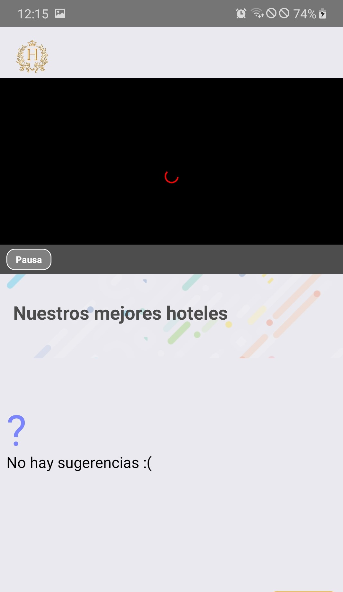
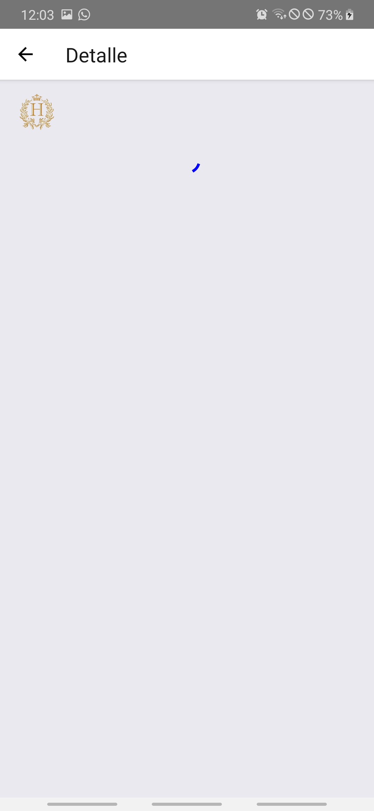
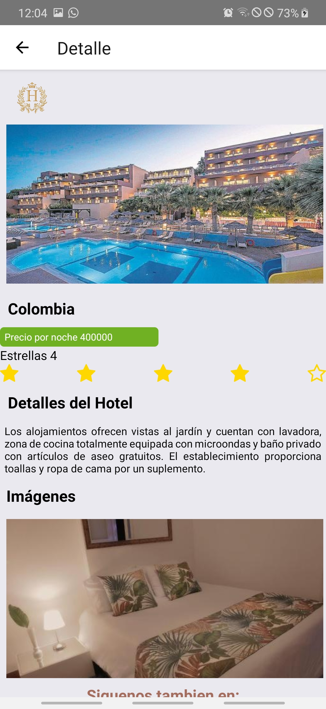
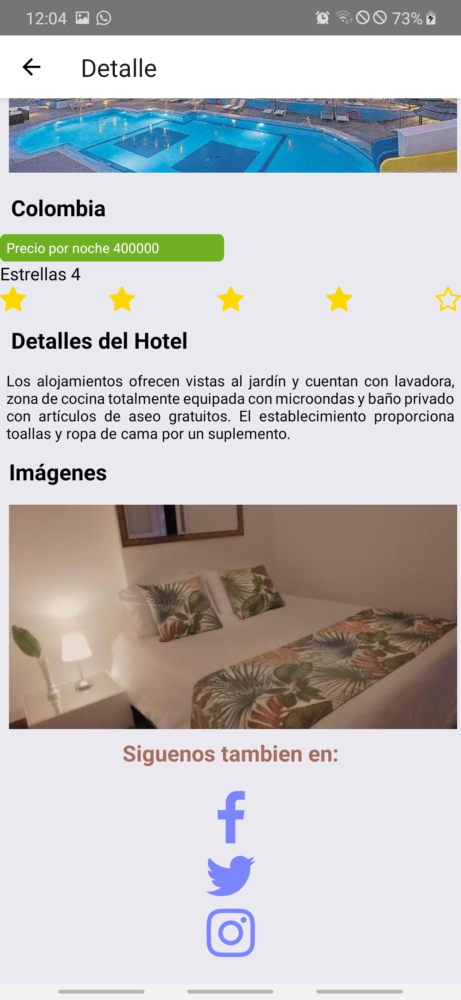

# react-native-app-hotels

Aplicación de hoteles: un ejercicio simple en react-native, de reacción con el consumo de API nodeJS

### Inicio rápido

```bash
# clonacion de repositorio
$ git clone https://github.com/iamalanadriana/api-hotels/tree/final

# Instalacion de dependencias npm
$ npm install

# Emulador de android con aplicaciones en ejecucion
$ react-native run-android
```

# Tabla de contenido

* [Dependencia](#dependencia)
* [Desarrollo](#desarollo)
* [Avances](#avances)

 ## Dependencia
 
Deberá ejecutar están dependencias:

* `node y npm`
Versiones del proyecto - Node (v10.15.3+) and NPM (6.4.1+)
 * `react-native: 0.61.5`

## Desarrollando
Después de haber instalado todas las dependencias, puede comenzar a desarrollar con:

* `react-native run-android`

Se iniciará el emulador deseado del sistema operativo móvil con la aplicación en ejecución, cualquier cambio realizado actualizará la aplicación en el emulador

## Avances

|  <br />
|   |  |  | 
